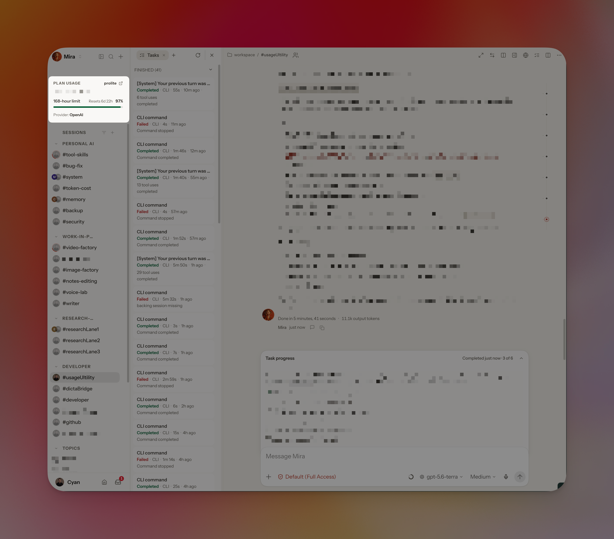

# OpenClaw Plan Usage Sidebar

[](https://github.com/openclaw/openclaw)
[](LICENSE)

A small, maintainable overlay for the [OpenClaw Control UI](https://github.com/openclaw/openclaw). It adds a persistent **Plan Usage** card below the sidebar brand, showing OpenAI/Codex quota windows without changing the upstream package in place.

> This is an unofficial community patch. It is pinned to OpenClaw `v2026.9.3` (`1391f7c`) and uses OpenClaw's native read-only `usage.status` Gateway RPC. It does not access provider credentials, OAuth tokens, cookies, or external websites.

## Screenshot



*Plan Usage stays pinned below the sidebar brand while the rest of the Control UI remains unchanged.*

## What it adds

- Persistent sidebar Plan Usage card for OpenAI/Codex quota groups.
- Clear quota capacity bar: green above 50%, yellow from 21–50%, red at 20% or below.
- Compact sidebar value such as `99%`; accessible labels retain the explicit “remaining” meaning.
- Provider account email when supplied by the native usage response.
- Instant re-render after browser reload from a recent browser-session snapshot, with a two-minute maximum age.
- Cache-cold recovery: retries the native usage request every second, up to five times, without replacing valid quota data with an empty loading result.
- Sessions placed visually before native navigation while preserving upstream keyboard and pinned-session ordering.

The existing composer keeps its detailed Plan Usage copy. Billing or budget rows retain their upstream `used / limit` presentation.

## Compatibility

| Component | Supported version |
| --- | --- |
| OpenClaw source | `v2026.9.3` |
| Source commit | `1391f7cd2d40ab5bbcf2f5f831d3a64f520e72d7` |
| Install strategy | Custom Control UI root |
| Global OpenClaw package | Never modified |

Do not apply this patch to a different OpenClaw version without running the validation commands below. A later OpenClaw update may change UI files or APIs.

## Install

### 1. Obtain the matching OpenClaw source

```bash
git clone --branch v2026.9.3 --depth 1 https://github.com/openclaw/openclaw.git openclaw-source
cd openclaw-source
```

### 2. Apply this patch and build the UI

```bash
/path/to/openclaw-plan-usage-sidebar/scripts/apply-patch.sh "$(pwd)" "/path/to/openclaw-plan-usage-sidebar"
/path/to/openclaw-plan-usage-sidebar/scripts/build-control-ui.sh "$(pwd)"
```

The scripts stop if the source is not the supported version or if the patch no longer applies cleanly.

### 3. Publish the built UI as a custom root

```bash
/path/to/openclaw-plan-usage-sidebar/scripts/publish-custom-root.sh \
  "$(pwd)/dist/control-ui" \
  "$HOME/.openclaw/control-ui-custom"
```

Then configure `gateway.controlUi.root` to point to the custom-root directory and restart the Gateway using OpenClaw's supported procedure. This changes runtime configuration, so review OpenClaw's current documentation and back up your configuration first.

Example inspection command:

```bash
openclaw config get gateway.controlUi
```

## Validate before publishing

Run these from the patched OpenClaw checkout:

```bash
corepack pnpm exec vitest run \
  ui/src/lib/provider-quota-summary.test.ts \
  ui/src/components/app-sidebar.test.ts \
  ui/src/components/provider-quota-card.test.ts \
  ui/src/components/sidebar-plan-usage.test.ts \
  ui/src/pages/chat/chat-composer-context.test.ts
corepack pnpm tsgo:ui
corepack pnpm ui:build
git diff --check
```

For a rendered check, hard-reload the Control UI after the Gateway restart. Verify the sidebar card, session list, native navigation, composer Plan Usage, and browser console.

## Update and rollback

- **Upgrade OpenClaw:** start with a fresh checkout of the new tag, run `git apply --check`, resolve any upstream changes deliberately, and rerun the validation suite.
- **Rollback:** remove or restore `gateway.controlUi.root`, restart the Gateway, then hard-reload the Control UI. The upstream bundled UI remains untouched by this project.

## Repository layout

```text
patches/   Exact overlay patch for OpenClaw v2026.9.3
scripts/   Guarded apply, build, and custom-root publish helpers
docs/      Screenshots and supporting documentation
.github/   CI, issue templates, and pull-request template
```

## Security and privacy

This patch only asks the connected Gateway for its native provider-usage summary. The browser-session cache contains the last valid quota summary for at most two minutes and stays in the local browser session. See [SECURITY.md](SECURITY.md).

## License and attribution

The patch contains derived portions of OpenClaw, which is licensed under MIT. This repository is also MIT-licensed. See [LICENSE](LICENSE) and [NOTICE.md](NOTICE.md).

## Contributing

Please read [CONTRIBUTING.md](CONTRIBUTING.md) before opening an issue or pull request.
